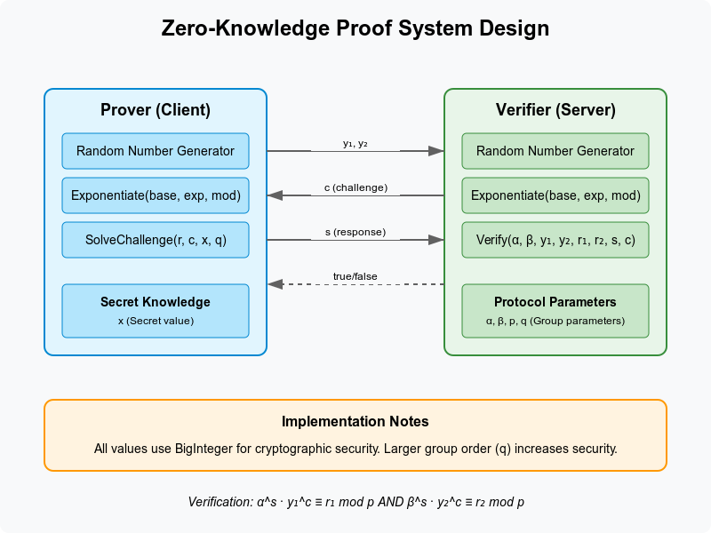

# 🔐 ZKP Authentication System

A Rust-based implementation of a Zero-Knowledge Proof (ZKP) authentication protocol using the Chaum-Pedersen protocol. This system simulates a Prover and Verifier exchange over gRPC to demonstrate secure authentication without revealing the secret.



---

## 📁 Project Structure

```txt
.
├── build.rs                   # Build script for compiling .proto files
├── Cargo.lock
├── Cargo.toml                 # Rust dependencies and package metadata
├── docker-compose.yaml        # Multi-service orchestration (optional gRPC server/client setup)
├── Dockerfile                 # Containerizes the app
├── proto
│   └── zkp_auth.proto         # gRPC protocol definitions
├── README.md
├── src
│   ├── client.rs              # gRPC client acting as the Prover
│   ├── lib.rs                 # Core ZKP logic and utilities
│   ├── server.rs              # gRPC server acting as the Verifier
│   └── zkp_auth.rs            # Proto-generated Rust bindings
└── Zkp-image.png              # Architecture diagram for visualization
```

---

## ⚙️ Features

* 🔐 **Zero-Knowledge Authentication** using Chaum-Pedersen protocol
* 🧠 Strong cryptographic primitives via `num-bigint` and modular math
* 🚀 Client-server model with **gRPC communication**
* 🐳 Docker and Docker Compose support
* 🧪 Easily extendable for real-world identity proofs

---

## 📆 Dependencies

Key crates used:

* `tonic` – gRPC in Rust
* `prost` – Protocol Buffers code generation
* `num-bigint` – Big integers for cryptography
* `rand` – Secure random number generation

Check `Cargo.toml` for full dependency list.

---

## 🚀 Running the Project

### 1. Clone and build the project

```bash
git clone https://github.com/code-vibe/zkp-chaum-pedersen.git
cd zkp-chaum-pedersen
cargo build
```

### 2. Run the Server (Verifier)

```bash
cargo run --bin server
```

### 3. Run the Client (Prover)

In a separate terminal:

```bash
cargo run --bin client
```

---

## 🐳 Docker Support

### Build and run using Docker:

```bash
docker build -t zkp-auth .
docker run -p 50051:50051 zkp-auth
```

### Or use Docker Compose:

```bash
docker-compose up --build
```

---

## 📱 gRPC Protocol

Defined in [`proto/zkp_auth.proto`](proto/zkp_auth.proto), which includes messages like:

* `ZkpRequest`
* `ZkpChallenge`
* `ZkpResponse`

The `build.rs` script compiles this into `src/zkp_auth.rs`.

---

## 🧠 How It Works

1. **Prover (Client)** generates values `y₁`, `y₂` and sends them.
2. **Verifier (Server)** sends a random challenge `c`.
3. **Prover** computes and sends response `s`.
4. **Verifier** checks:

   ```
   α^s * y₁^c ≡ r₁ mod p
   β^s * y₂^c ≡ r₂ mod p
   ```

No secret is ever transmitted — zero knowledge!

---

## 🧪 Testing

You can add unit tests in `lib.rs` and integration tests under `tests/`.

Run tests with:

```bash
cargo test
```

---

## 📄 License

MIT License. See `LICENSE` file for details.

---

## 🤝 Contributing

Pull requests and discussions are welcome! If you're interested in extending this to support zk-SNARKs or integrating with identity layers, open an issue.

---
## 🧱 ZKP gRPC Server (Docker Setup)
1. **Build the Docker Image**

```bash
docker build -t zkpserver .
```

2. **Run the Server**

```bash
docker run --name zkpserver -p 50051:50051 zkpserver
```

> ✅ The server should now be running at `127.0.0.1:50051`

---

### 🧪 Test the Server
#### Using Postman:

1. Install the gRPC beta version of Postman.
2. Create a new gRPC request.
3. Set server URL to `localhost:50051`.
4. Import your `.proto` file and select the service/method.
5. Input request payload (JSON format).
6. Send the request and inspect the response.

---

## 🤝 Future Improvements

* Web frontend for authentication demo
* Persistent storage (Postgres + Diesel or SeaORM)
* Benchmarking and optimization
* Real-world use-case simulation (e.g., login without password)
